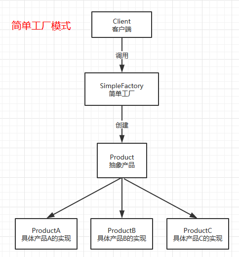
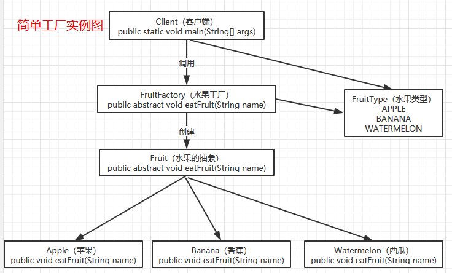

[🎉 面试进阶指南已上线](https://xiaozhuanlan.com/CyC2018)
<!-- GFM-TOC -->
* [一、概述](#一概述)
* [二、创建型模式](#二创建型模式)
    * [1. 简单工厂模式（Simple Factory）](#1-单例singleton)
    * [2. 工厂方法模式（Factory Method）](#2-简单工厂simple-factory)
    * [3. 抽象工厂模式（Abstract Factory）](#3-工厂方法factory-method)
    * [4. 单例模式（Singletom）](#4-抽象工厂abstract-factory)
    * [5. 创建者模式（Builder）](#5-生成器builder)
    * [6. 原型模式（Prototype）](#6-原型模式prototype)
* [三、结构型模式](#四结构型)
    * [1. 适配器模式（Adapter）](#1-适配器adapter)
    * [2. 外观模式（Facade）](#2-桥接bridge)
    * [3. 享元模式（Flyweight）](#3-组合composite)
    * [4. 组合模式（Composite）](#4-装饰decorator)
    * [5. 装饰器模式（Decorator）](#5-外观facade)
    * [6. 代理模式（Proxy）](#6-享元flyweight)
    * [7. 桥接模式（Bridge）](#7-代理proxy)
* [四、行为型模式](#三行为型)
    * [1. 策略模式（Strategy）](#1-责任链chain-of-responsibility)
    * [2. 状态模式（State）](#2-命令command)
    * [3. 职责链模式（Chain of Responsibility）](#3-解释器interpreter)
    * [4. 观察者模式（Observer）](#4-迭代器iterator)
    * [5. 模板方法模式（Template Method）](#5-中介者mediator)
    * [6. 命令模式（Command）](#6-备忘录memento)
    * [7. 备忘录模式（Memento）](#7-观察者observer)
    * [8. 迭代器模式（Iterator）](#8-状态state)
    * [9. 调停者模式（Mediator）](#9-策略strategy)
    * [10. 解释器模式（Interpreter）](#10-模板方法template-method)
    * [11. 访问者模式（Visitor）](#11-访问者visitor)
* [参考资料](#参考资料)
<!-- GFM-TOC -->

# 一、概述

##六大原则 
所有的设计模式都遵循以下六个基本的设计原则。 

* 单一职责原则: The Single Responsibility Principle(SRP) 
* 开放封闭原则: The Open Closed Principle(OCP) 
* 里氏替换原则: The Liskov Substitution Principle(LSP) 
* 迪米特法则: The law of Demeter(LD) 
* 接口隔离原则: The Interface Segregation Principle(ISP) 
* 依赖倒置原则: The Dependency Inversion Principle(DIP) 

六大设计原则取其英文首字母简称为SOLID原则。 

##单一职责原则 
一个类只做一件事情，不去做与这个类的主要职责无关的事情。
 
##开放封闭原则 
对扩展开放，对修改关闭。即类或者接口定义好之后不可进行破坏性的更新！开闭原则的目的是为了保持类或者接口后续版本能够向后兼容。开闭原则是六大原则中最重要的一个！ 虽然理论上我们应该严格遵守开闭原则，不过现实中任何一个软件在设计的时候都无法预料到后续发展中的所有需求，所以修改几乎不可避免。我们只能在进行设计的时候尽可能的去遵守这些原则！ 

##里氏替换原则 
所有父类可以出现的地方，都可以透明的用子类替换。也就是说，子类可以扩展父类，但是不可以修改父类的原有功能。子类 is a 实现 of 父类。 

##迪米特法则 
迪米特法则又叫最少知识原则Least Knowledge Principle(LKP)，意思是一个类应该对他自己所依赖的类知道的越少越好！高内聚，低耦合。 

##接口隔离原则 
使用多个小的更具体的接口比使用一个臃肿的接口要更好！原则就是被用来违反的！对修改关闭？怎么可能！谁写的代码可以一步到位永久不修改的吗！ 另外细一点的接口也有利于客户端遵守最少知识原则。 

##依赖倒置原则 
不要依赖具体实现，要依赖抽象！也就是面向“接口”编程而不是面向实现类编程！这样做可以解除客户端与实现类的耦合。 

##六大设计原则总结 
开闭原则要求我们写好的类不要去修改，如果需要增加功能，那么扩展它。单一职责原则要求我们一个类只做一件事情。里氏替换原则要求我们子类必须兼容父类。迪米特法则要求我们尽可能少的依赖其他的类。接口隔离原则要求我们定义接口的时候尽可能简单一些。依赖倒置原则要求我们不能去依赖实现类！


# 二、创建型模式

## 1. 简单工厂模式（Simple Factory）

### 原理图
<div align="center">  </div><br>

### 角色以及职责 
* 抽象产品： 工厂产物的抽象。工厂要创建的实例类都继承于此抽象产品。 
* 具体产品： 工厂的具体产品。所有的具体产品都是抽象产品的一个实现类。 
* 工厂： 创建产品实例的类。这个类负责创建具体产品的实例，并对客户端隐藏创建过程的细节。 

### 适用场景 
创建对象的过程比较麻烦，客户端并不关心具体有多少种实现而只希望获得一个能够满足他的需求的实例的引用，然后客户端可以通过公共的接口去使用这个产品。 

### 简单工厂模式分析 
简单工厂模式是客户端与抽象接口实现解耦的最简单直接的方式。通过引入工厂这个角色，客户端可以不用任何具体产品的创建细节。客户端需要一种具体的实例的时候，只需要通知工厂。具体工厂是如何生产的，以及生产过程中涉及到了哪些工厂内部的角色，客户端可以统统不用关心。当具体的某种产品需要修改时，只需要修改对应的实现类和工厂就可以了。 

这个模式存在的问题，即实现类的创建过程修改了之后，有时工厂的实现也得跟着修改。虽然对客户端的接口是保持不变的，但是对工厂本身的修改还是有点不符合开闭原则。解决这个问题的答案是工厂方法模式。

### 实例 
本文将以一个创建“运载工具”的实例的例子来介绍简单工厂模式。 

### 类图
<div align="center">  </div><br>

### 编码实现
步骤一：定义好工厂要生成的产品的抽象
```
/**
 * 水果的抽象
 *
 * @author:ABugKiller
 * @date:Created in 2019/1/30 22:15
 */
public abstract class Fruit {

    /**
     * 谁谁谁吃什么水果
     * @author:ABugKiller
     * @date:Created in 2019/1/30 22:20
     * @Param: name  姓名
     * @return:
     */
    public abstract void eatFruit(String name);
}
```

步骤二：给抽象的产品定义集中具体的实现
```aidl
/**
 * Apple
 *
 * @author:ABugKiller
 * @date:Created in 2019/1/30 22:24
 */
public class Apple extends Fruit {

    @Override
    public void eatFruit(String name) {
        System.out.println(String.format("%s吃苹果", name));
    }
}
```
```aidl
/**
 * 香蕉
 *
 * @author:ABugKiller
 * @date:Created in 2019/1/30 22:26
 */
public class Banana extends Fruit {

    @Override
    public void eatFruit(String name) {
        System.out.println(String.format("%s吃香蕉", name));
    }
}
```
```aidl
/**
 * 西瓜
 *
 * @author:ABugKiller
 * @date:Created in 2019/1/30 22:25
 */
public class Watermelon extends Fruit {

    @Override
    public void eatFruit(String name) {
        System.out.println(String.format("%s吃西瓜", name));
    }
}
```

步骤三：定义一个水果类型的枚举
```aidl
/**
 * 水果类型的枚举
 *
 * @author:ABugKiller
 * @date:Created in 2019/1/30 22:11
 */
public enum FruitType {

    /**
     * 苹果
     */
    APPLE,

    /**
     * 香蕉
     */
    BANANA,

    /**
     * 西瓜
     */
    WATERMELON
}
```

步骤四：定义水果的工厂
```aidl
/**
 * 水果的工厂
 *
 * @author:ABugKiller
 * @date:Created in 2019/1/30 22:27
 */
public class FruitFactory {
    public static Fruit getFruit(FruitType type) {
        switch (type) {
            case APPLE:
                return new Apple();
            case BANANA:
                return new Banana();
            case WATERMELON:
                return new Watermelon();
            default:
                throw new IllegalArgumentException("未知水果类型");
        }
    }
}
```

步骤五：调用工厂的客户端
```aidl
/**
 * 客户端调用
 *
 * @author:BugKiller
 * @date:Created in 2019/1/30 22:07
 */
public class Client {

    public static void main(String[] args) {
        //ad吃苹果
        Fruit fruit = FruitFactory.getFruit(FruitType.APPLE);
        fruit.eatFruit("ad");
        //ad吃香蕉
        fruit = FruitFactory.getFruit(FruitType.BANANA);
        fruit.eatFruit("ad");
        //ad吃西瓜
        fruit = FruitFactory.getFruit(FruitType.WATERMELON);
        fruit.eatFruit("ad");
    }
}

```


## 2. 工厂方法模式（Factory Method）

## 3. 抽象工厂模式（Abstract Factory）

## 4. 单例模式（Singletom）

## 5. 创建者模式（Builder）

## 6. 原型模式（Prototype）

# 三、结构型模式

## 1. 适配器模式（Adapter）

## 2. 外观模式（Facade）

## 3. 享元模式（Flyweight）

## 4. 组合模式（Composite）

## 5. 装饰器模式（Decorator）

## 6. 代理模式（Proxy）

# 四、行为型模式

## 1. 策略模式（Strategy）

## 2. 状态模式（State）

## 3. 职责链模式（Chain of Responsibility）

## 4. 观察者模式（Observer）

## 5. 模板方法模式（Template Method）

## 6. 命令模式（Command）

## 7. 备忘录模式（Memento）

## 8. 迭代器模式（Iterator）

## 9. 调停者模式（Mediator）

## 10. 解释器模式（Interpreter）

## 11. 访问者模式（Visitor）


# 参考资料

- 弗里曼. Head First 设计模式 [M]. 中国电力出版社, 2007.
- Gamma E. 设计模式: 可复用面向对象软件的基础 [M]. 机械工业出版社, 2007.
- Bloch J. Effective java[M]. Addison-Wesley Professional, 2017.
- [Design Patterns](http://www.oodesign.com/)
- [Design patterns implemented in Java](http://java-design-patterns.com/)
- [The breakdown of design patterns in JDK](http://www.programering.com/a/MTNxAzMwATY.html)
