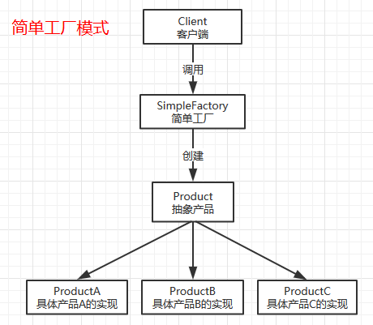

<!-- GFM-TOC -->
* [一、概述](#一概述)
* [二、创建型模式](#二创建型模式)
    * [1. 简单工厂模式（Simple Factory）](#1-简单工厂模式simple-factory)
    * [2. 工厂方法模式（Factory Method）](#2-工厂方法模式factory-method)
    * [3. 抽象工厂模式（Abstract Factory）](#3-抽象工厂模式abstract-factory)
    * [4. 单例模式（Singletom）](#4-单例模式singletom)
    * [5. 创建者模式（Builder）](#5-创建者模式builder)
    * [6. 原型模式（Prototype）](#6-原型模式prototype)
* [三、结构型模式](#三结构型模式)
    * [1. 适配器模式（Adapter）](#1-适配器模式adapter)
    * [2. 外观模式（Facade）](#2-外观模式facade)
    * [3. 享元模式（Flyweight）](#3-享元模式flyweight)
    * [4. 组合模式（Composite）](#4-组合模式composite)
    * [5. 装饰器模式（Decorator）](#5-装饰器模式decorator)
    * [6. 代理模式（Proxy）](#6-代理模式proxy)
    * [7. 桥接模式（Bridge）](#7-桥接模式bridge)
* [四、行为型模式](#四行为型模式)
    * [1. 策略模式（Strategy）](#1-策略模式strategy)
    * [2. 状态模式（State）](#2-状态模式state)
    * [3. 职责链模式（Chain of Responsibility）](#3-职责链模式chain-of-responsibility)
    * [4. 观察者模式（Observer）](#4-观察者模式observer)
    * [5. 模板方法模式（Template Method）](#5-模板方法模式template-method)
    * [6. 命令模式（Command）](#6-命令模式command)
    * [7. 备忘录模式（Memento）](#7-备忘录模式memento)
    * [8. 迭代器模式（Iterator）](#8-迭代器模式iterator)
    * [9. 调停者模式（Mediator）](#9-调停者模式mediator)
    * [10. 解释器模式（Interpreter）](#10-解释器模式interpreter)
    * [11. 访问者模式（Visitor）](#11-访问者模式visitor)
* [参考资料](#参考资料)
<!-- GFM-TOC -->

# 一、概述

##六大原则 
所有的设计模式都遵循以下六个基本的设计原则。 

* 单一职责原则: The Single Responsibility Principle(SRP) 
* 开放封闭原则: The Open Closed Principle(OCP) 
* 里氏替换原则: The Liskov Substitution Principle(LSP) 
* 迪米特法则: The law of Demeter(LD) 
* 接口隔离原则: The Interface Segregation Principle(ISP) 
* 依赖倒置原则: The Dependency Inversion Principle(DIP) 

六大设计原则取其英文首字母简称为SOLID原则。 

##单一职责原则 
一个类只做一件事情，不去做与这个类的主要职责无关的事情。
 
##开放封闭原则 
对扩展开放，对修改关闭。即类或者接口定义好之后不可进行破坏性的更新！开闭原则的目的是为了保持类或者接口后续版本能够向后兼容。开闭原则是六大原则中最重要的一个！ 虽然理论上我们应该严格遵守开闭原则，不过现实中任何一个软件在设计的时候都无法预料到后续发展中的所有需求，所以修改几乎不可避免。我们只能在进行设计的时候尽可能的去遵守这些原则！ 

##里氏替换原则 
所有父类可以出现的地方，都可以透明的用子类替换。也就是说，子类可以扩展父类，但是不可以修改父类的原有功能。子类 is a 实现 of 父类。 

##迪米特法则 
迪米特法则又叫最少知识原则Least Knowledge Principle(LKP)，意思是一个类应该对他自己所依赖的类知道的越少越好！高内聚，低耦合。 

##接口隔离原则 
使用多个小的更具体的接口比使用一个臃肿的接口要更好！原则就是被用来违反的！对修改关闭？怎么可能！谁写的代码可以一步到位永久不修改的吗！ 另外细一点的接口也有利于客户端遵守最少知识原则。 

##依赖倒置原则 
不要依赖具体实现，要依赖抽象！也就是面向“接口”编程而不是面向实现类编程！这样做可以解除客户端与实现类的耦合。 

##六大设计原则总结 
开闭原则要求我们写好的类不要去修改，如果需要增加功能，那么扩展它。单一职责原则要求我们一个类只做一件事情。里氏替换原则要求我们子类必须兼容父类。迪米特法则要求我们尽可能少的依赖其他的类。接口隔离原则要求我们定义接口的时候尽可能简单一些。依赖倒置原则要求我们不能去依赖实现类！


# 二、创建型模式

## 1. 简单工厂模式（Simple Factory）

### 原理图
<div align="center">  </div><br>

### 角色以及职责 
* 抽象产品： 工厂产物的抽象。工厂要创建的实例类都继承于此抽象产品。 
* 具体产品： 工厂的具体产品。所有的具体产品都是抽象产品的一个实现类。 
* 工厂： 创建产品实例的类。这个类负责创建具体产品的实例，并对客户端隐藏创建过程的细节。 

### 适用场景 
创建对象的过程比较麻烦，客户端并不关心具体有多少种实现而只希望获得一个能够满足他的需求的实例的引用，然后客户端可以通过公共的接口去使用这个产品。 

### 简单工厂模式分析 
简单工厂模式是客户端与抽象接口实现解耦的最简单直接的方式。通过引入工厂这个角色，客户端可以不用任何具体产品的创建细节。客户端需要一种具体的实例的时候，只需要通知工厂。具体工厂是如何生产的，以及生产过程中涉及到了哪些工厂内部的角色，客户端可以统统不用关心。当具体的某种产品需要修改时，只需要修改对应的实现类和工厂就可以了。 

这个模式存在的问题，即实现类的创建过程修改了之后，有时工厂的实现也得跟着修改。虽然对客户端的接口是保持不变的，但是对工厂本身的修改还是有点不符合开闭原则。解决这个问题的答案是工厂方法模式。

### 实例 
本文将以一个创建“水果”的实例的例子来介绍简单工厂模式。 

### 类图
<div align="center">  </div><br>

### 编码实现
步骤一：定义好工厂要生成的产品的抽象
```java
/**
 * 水果的抽象
 *
 * @author:ABugKiller
 * @date:Created in 2019/1/30 22:15
 */
public abstract class Fruit {

    /**
     * 谁谁谁吃什么水果
     * @author:ABugKiller
     * @date:Created in 2019/1/30 22:20
     * @Param: name  姓名
     * @return:
     */
    public abstract void eatFruit(String name);
}
```

步骤二：给抽象的产品定义集中具体的实现
```java
/**
 * Apple
 *
 * @author:ABugKiller
 * @date:Created in 2019/1/30 22:24
 */
public class Apple extends Fruit {

    @Override
    public void eatFruit(String name) {
        System.out.println(String.format("%s吃苹果", name));
    }
}
```
```java
/**
 * 香蕉
 *
 * @author:ABugKiller
 * @date:Created in 2019/1/30 22:26
 */
public class Banana extends Fruit {

    @Override
    public void eatFruit(String name) {
        System.out.println(String.format("%s吃香蕉", name));
    }
}
```
```java
/**
 * 西瓜
 *
 * @author:ABugKiller
 * @date:Created in 2019/1/30 22:25
 */
public class Watermelon extends Fruit {

    @Override
    public void eatFruit(String name) {
        System.out.println(String.format("%s吃西瓜", name));
    }
}
```

步骤三：定义一个水果类型的枚举
```java
/**
 * 水果类型的枚举
 *
 * @author:ABugKiller
 * @date:Created in 2019/1/30 22:11
 */
public enum FruitType {

    /**
     * 苹果
     */
    APPLE,

    /**
     * 香蕉
     */
    BANANA,

    /**
     * 西瓜
     */
    WATERMELON
}
```

步骤四：定义水果的工厂
```java
/**
 * 水果的工厂
 *
 * @author:ABugKiller
 * @date:Created in 2019/1/30 22:27
 */
public class FruitFactory {
    public static Fruit getFruit(FruitType type) {
        switch (type) {
            case APPLE:
                return new Apple();
            case BANANA:
                return new Banana();
            case WATERMELON:
                return new Watermelon();
            default:
                throw new IllegalArgumentException("未知水果类型");
        }
    }
}
```

步骤五：调用工厂的客户端
```java
/**
 * 客户端调用
 *
 * @author:BugKiller
 * @date:Created in 2019/1/30 22:07
 */
public class Client {

    public static void main(String[] args) {
        //ad吃苹果
        Fruit fruit = FruitFactory.getFruit(FruitType.APPLE);
        fruit.eatFruit("ad");
        //ad吃香蕉
        fruit = FruitFactory.getFruit(FruitType.BANANA);
        fruit.eatFruit("ad");
        //ad吃西瓜
        fruit = FruitFactory.getFruit(FruitType.WATERMELON);
        fruit.eatFruit("ad");
    }
}
```


## 2. 工厂方法模式（Factory Method）

### 原理图
<div align="center">  </div><br>

### 角色以及职责 
* 抽象产品： 工厂产物的抽象。工厂所要创建的实例的类都继承于这个。 
* 具体产品： 工厂的具体产品。所有的具体产品都是抽象产品的一个实现类。 
* 抽象工厂： 工厂类的抽象。 
* 具体工厂： 创建产品实例的具体工厂类。

### 适用场景 
创建产品对象的过程比较复杂，客户端并不关心如何创建产品对象，只想使用产品。此外产品的类型比较多，编写代码的时候没有可能去完全枚举所有的具体产品，未来还有可能会增加。

### 简单工厂模式分析 
工厂方法模式（Factory Method）是简单工厂模式（Simple Factory）的一个升级版，通过对工厂本身也抽象一层，实现了工厂自身可以在完全满足开闭原则的情况下的可扩展性。当未来需要创建新的产品的对象的时候，只需要新增一个负责创建新产品的工厂即可。 

不过工厂方法模式也存在自己的问题！工厂方法模式会使客户端的调用过程变得更复杂。

### 实例 
本文将以一个“水果加工”的实例的例子来介绍工厂方法模式。

### 编码实现
步骤一：定义好工厂要生成的产品的抽象
```java
/**
 * 水果抽象类
 *
 * @author:ABugKiller
 * @date:Created in 2019/1/31 18:46
 */
public abstract class Fruit {

    /**
     * 加工水果
     * @author:ABugKiller
     * @date:Created in 2019/1/31 18:47
     * @return:
     */
    public abstract void process();
}
```

步骤二：给抽象的产品定义集中具体的实现
```java
/**
 * 苹果
 * @author:ABugKiller
 * @date:Created in 2019/1/31 18:47
 */
public class Apple extends Fruit {
    @Override
    public void process() {
        System.out.println("苹果加工完毕");
    }
}
```

```java
/**
 * 香蕉
 *
 * @author:ABugKiller
 * @date:Created in 2019/1/31 18:48
 */
public class Banana extends Fruit {
    @Override
    public void process() {
        System.out.println("香蕉加工完毕");
    }
}
```

```java
/**
 * 西瓜
 *
 * @author:ABugKiller
 * @date:Created in 2019/1/31 18:48
 */
public class Watermelon extends Fruit {
    @Override
    public void process() {
        System.out.println("西瓜加工完毕");
    }
}
```

步骤三：定义一个工厂的抽象
```java
/**
 * 水果工厂的抽象
 *
 * @author:ABugKiller
 * @date:Created in 2019/1/31 18:39
 */
public interface FruitFactory {

    /**
     * 创建水果工厂
     * @author:ABugKiller
     * @date:Created in 2019/1/31 18:40
     * @return:
     */
    public Fruit newInstance();
}
```

步骤四：定义抽象工厂的具体实现
```java
/**
 * 苹果工厂
 *
 * @author:ABugKiller
 * @date:Created in 2019/1/31 18:41
 */
public class AppleFactory implements FruitFactory {

    @Override
    public Fruit newInstance() {
        return new Apple();
    }
}
```

```java
/**
 * 香蕉工厂
 *
 * @author:ABugKiller
 * @date:Created in 2019/1/31 18:41
 */
public class BananaFactoroy implements FruitFactory {

    @Override
    public Fruit newInstance() {
        return new Banana();
    }
}
```

```java
/**
 * 西瓜工厂
 *
 * @author:ABugKiller
 * @date:Created in 2019/1/31 18:42
 */
public class WatermelonFactory implements FruitFactory {

    @Override
    public Fruit newInstance() {
        return new Watermelon();
    }
}
```

步骤五：客户端调用
```java
/**
 * 客户端
 *
 * @author:BugKiller
 * @date:Created in 2019/1/31 18:37
 */
public class Client {

    public static void main(String[] args) throws Exception{
        String[] factoryClasses = {
                "com.ad.factory.AppleFactory",
                "com.ad.factory.BananaFactoroy",
                "com.ad.factory.WatermelonFactory"
        };

        for (int i = 0; i < factoryClasses.length; i++) {
            Class<?> cls = Class.forName(factoryClasses[i]);
            FruitFactory fruitFactory = (FruitFactory) cls.newInstance();
            Fruit fruit = fruitFactory.newInstance();
            fruit.process();
        }
    }
}
```


## 3. 抽象工厂模式（Abstract Factory）

### 原理图
<div align="center">  </div><br>

### 角色以及职责 
* 抽象产品： 工厂产物的抽象。由工厂创建的所有系列产品都集成自这些抽象产品。 
* 具体产品： 工厂的具体产品。所有的具体产品都是抽象产品的一个实现类。 
* 抽象工厂： 工厂类的抽象。 
* 具体工厂： 创建产品实例的具体工厂类。可以理解为产品的具体的“供应商”。

### 适用场景 
客户端用到的多个产品之间相互关联，并且客户端不希望与当前用到的系列产品直接“绑定”，希望可以灵活的切换系列产品的“供应商”。

### 简单工厂模式分析 
抽象工厂本质上是一个产品族的“供应商”，通过抽象供应商和产品的方式，将客户端与产品族和“供应商”解耦。抽象工厂模式可以非常容易的实现切换系列产品的“供应商”。

缺点是如果后面增加了产品的话，会导致所有的工厂都需要修改！所以应用抽象工厂模式的时候，需要注意这点！很多前辈说抽象工厂模式是工厂方法模式的升级版，但是我并不这么认为。工厂方法模式是对单一种类的抽象产品的不同具体实现的创建过程进行的抽象，而抽象工厂模式是对系列产品的创建过程进行的抽象。前者为了方便扩展其他的具体产品，后者是为了方便将整个产品族整体切换为其他“供应商”。

### 实例 
这里通过一个数码设备工厂来演示抽象工厂模式的用法。数码设备工厂是生产数码设备的工厂的抽象，在本例中有两个实现，一个是苹果公司的工厂，一个是三星公司的工厂。所要创建的产品在本例中有三种，笔记本电脑、智能手机、平板电脑。

### 编码实现
步骤一：定义三种抽象产品
```java
/**
 * 笔记本电脑
 *
 * @author:ABugKiller
 * @date:Created in 2019/1/31 19:55
 */
public interface Laptop {
    /**
     * 编程
     * @author:ABugKiller
     * @date:Created in 2019/1/31 21:13
     * @return:
     */
    public void coding(String operator);
}
```

```java
/**
 * 平板电脑
 *
 * @author:ABugKiller
 * @date:Created in 2019/1/31 19:59
 */
public interface Pad {

    /**
     * 玩游戏
     * @author:ABugKiller
     * @date:Created in 2019/1/31 21:14
     * @return:
     */
    public void playGame();
}
```

```java
/**
 * 手机
 *
 * @author:ABugKiller
 * @date:Created in 2019/1/31 19:56
 */
public interface Phone {

    /**
     * 设置拥有者
     * @author:ABugKiller
     * @date:Created in 2019/1/31 21:14
     * @return:
     */
    public void setOwner(String owner);

    /**
     * 打电话
     * @author:ABugKiller
     * @date:Created in 2019/1/31 21:15
     * @return:
     */
    public void call();
}
```

步骤二：定义苹果公司的工厂生产的具体产品

```java
/**
 * 苹果电脑
 *
 * @author:ABugKiller
 * @date:Created in 2019/1/31 20:00
 */
public class MacBook implements Laptop {
    @Override
    public void coding(String operator) {
        System.out.println("用Mac撸代码");
    }
}
```

```java
/**
 * 苹果手机
 *
 * @author:ABugKiller
 * @date:Created in 2019/1/31 20:01
 */
public class IPhone implements Phone {

    private String owner;

    @Override
    public void setOwner(String owner) {
        this.owner = owner;
    }

    @Override
    public void call() {
        System.out.println(String.format("%s在用IPhone打电话！", this.owner));
    }
}
```

```java
/**
 * 苹果手表
 *
 * @author:ABugKiller
 * @date:Created in 2019/1/31 20:04
 */
public class IPad implements Pad {
    @Override
    public void playGame() {
        System.out.println("用IPad玩游戏");
    }
}
```

步骤三：定义三星公司的工厂生产的具体产品
```java
/**
 * 三星电脑
 *
 * @author:ABugKiller
 * @date:Created in 2019/1/31 20:00
 */
public class SamsungNoteBook implements Laptop {
    @Override
    public void coding(String operator) {
        System.out.println("用三星电脑撸代码");
    }
}
```
```java
/**
 * 三星手机
 *
 * @author:ABugKiller
 * @date:Created in 2019/1/31 20:03
 */
public class SamsungGalaxy implements Phone {

    private String owner;

    @Override
    public void setOwner(String owner) {
        this.owner = owner;
    }

    @Override
    public void call() {
        System.out.println(String.format("%s在用三星手机打电话！", this.owner));
    }
}
```

```java
/**
 * 三星平板
 *
 * @author:ABugKiller
 * @date:Created in 2019/1/31 20:05
 */
public class SamsungPad implements Pad {
    @Override
    public void playGame() {
        System.out.println("用三星平板玩游戏");
    }
}
```

步骤四：定义抽象工厂及实现类
```java
/**
 * 数码设备工厂
 *
 * @author:ABugKiller
 * @date:Created in 2019/1/31 19:54
 */
public interface DigitalEquipmentFactory {
    //生产笔记本电脑
    public Laptop manufactureLaptop();
    //生产手机
    public Phone manufacturePhone();
    //生产平板电脑
    public Pad manufacturePad();
}
```

```java
/**
 * 苹果工厂
 *
 * @author:ABugKiller
 * @date:Created in 2019/1/31 20:09
 */
public class AppleFactory implements DigitalEquipmentFactory {
    @Override
    public Laptop manufactureLaptop() {
        return new MacBook();
    }

    @Override
    public Phone manufacturePhone() {
        return new IPhone();
    }

    @Override
    public Pad manufacturePad() {
        return new IPad();
    }
}
```

```java
/**
 * 三星工厂
 *
 * @author:ABugKiller
 * @date:Created in 2019/1/31 20:10
 */
public class SamsungFactory implements DigitalEquipmentFactory {
    @Override
    public Laptop manufactureLaptop() {
        return new SamsungNoteBook();
    }

    @Override
    public Phone manufacturePhone() {
        return new SamsungGalaxy();
    }

    @Override
    public Pad manufacturePad() {
        return new SamsungPad();
    }
}
```

步骤四：客户端
```java
/**
 * 客户端
 *
 * @author:ABugKiller
 * @date:Created in 2019/1/31 19:26
 */
public class Client {
    public static void main(String[] args) throws Exception {

        String[] factoryClasses = {
                "com.ad.factory.AppleFactory",
                "com.ad.factory.SamsungFactory"
        };

        for (int i = 0; i < factoryClasses.length; i++) {
            System.out.println(factoryClasses[i]);
            Class<?> cls = Class.forName(factoryClasses[i]);
            DigitalEquipmentFactory factory = (DigitalEquipmentFactory) cls.newInstance();
            Laptop laptop = factory.manufactureLaptop();
            laptop.coding("ad");
            Pad pad = factory.manufacturePad();
            pad.playGame();
            Phone phone = factory.manufacturePhone();
            phone.setOwner("ad");
            phone.call();
        }
    }
}
```


## 4. 单例模式（Singletom）

### 原理图
<div align="center">  </div><br>

### 角色以及职责 

### 适用场景 

### 简单工厂模式分析 

### 实例 

### 类图
<div align="center">  </div><br>

### 编码实现


## 5. 创建者模式（Builder）

### 原理图
<div align="center">  </div><br>

### 角色以及职责 

### 适用场景 

### 简单工厂模式分析 

### 实例 

### 类图
<div align="center">  </div><br>

### 编码实现


## 6. 原型模式（Prototype）

### 原理图
<div align="center">  </div><br>

### 角色以及职责 

### 适用场景 

### 简单工厂模式分析 

### 实例 

### 类图
<div align="center">  </div><br>

### 编码实现


# 三、结构型模式

## 1. 适配器模式（Adapter）

### 原理图
<div align="center">  </div><br>

### 角色以及职责 

### 适用场景 

### 简单工厂模式分析 

### 实例 

### 类图
<div align="center">  </div><br>

### 编码实现


## 2. 外观模式（Facade）

### 原理图
<div align="center">  </div><br>

### 角色以及职责 

### 适用场景 

### 简单工厂模式分析 

### 实例 

### 类图
<div align="center">  </div><br>

### 编码实现


## 3. 享元模式（Flyweight）

### 原理图
<div align="center">  </div><br>

### 角色以及职责 

### 适用场景 

### 简单工厂模式分析 

### 实例 

### 类图
<div align="center">  </div><br>

### 编码实现


## 4. 组合模式（Composite）

### 原理图
<div align="center">  </div><br>

### 角色以及职责 

### 适用场景 

### 简单工厂模式分析 

### 实例 

### 类图
<div align="center">  </div><br>

### 编码实现


## 5. 装饰器模式（Decorator）

### 原理图
<div align="center">  </div><br>

### 角色以及职责 

### 适用场景 

### 简单工厂模式分析 

### 实例 

### 类图
<div align="center">  </div><br>

### 编码实现


## 6. 代理模式（Proxy）

### 原理图
<div align="center">  </div><br>

### 角色以及职责 

### 适用场景 

### 简单工厂模式分析 

### 实例 

### 类图
<div align="center">  </div><br>

### 编码实现


## 7. 桥接模式（Bridge）

### 原理图
<div align="center">  </div><br>

### 角色以及职责 

### 适用场景 

### 简单工厂模式分析 

### 实例 

### 类图
<div align="center">  </div><br>

### 编码实现


# 四、行为型模式

## 1. 策略模式（Strategy）

### 原理图
<div align="center">  </div><br>

### 角色以及职责 

### 适用场景 

### 简单工厂模式分析 

### 实例 

### 类图
<div align="center">  </div><br>

### 编码实现


## 2. 状态模式（State）

### 原理图
<div align="center">  </div><br>

### 角色以及职责 

### 适用场景 

### 简单工厂模式分析 

### 实例 

### 类图
<div align="center">  </div><br>

### 编码实现


## 3. 职责链模式（Chain of Responsibility）

### 原理图
<div align="center">  </div><br>

### 角色以及职责 

### 适用场景 

### 简单工厂模式分析 

### 实例 

### 类图
<div align="center">  </div><br>

### 编码实现


## 4. 观察者模式（Observer）

### 原理图
<div align="center">  </div><br>

### 角色以及职责 

### 适用场景 

### 简单工厂模式分析 

### 实例 

### 类图
<div align="center">  </div><br>

### 编码实现


## 5. 模板方法模式（Template Method）

### 原理图
<div align="center">  </div><br>

### 角色以及职责 

### 适用场景 

### 简单工厂模式分析 

### 实例 

### 类图
<div align="center">  </div><br>

### 编码实现


## 6. 命令模式（Command）

### 原理图
<div align="center">  </div><br>

### 角色以及职责 

### 适用场景 

### 简单工厂模式分析 

### 实例 

### 类图
<div align="center">  </div><br>

### 编码实现


## 7. 备忘录模式（Memento）

### 原理图
<div align="center">  </div><br>

### 角色以及职责 

### 适用场景 

### 简单工厂模式分析 

### 实例 

### 类图
<div align="center">  </div><br>

### 编码实现


## 8. 迭代器模式（Iterator）

### 原理图
<div align="center">  </div><br>

### 角色以及职责 

### 适用场景 

### 简单工厂模式分析 

### 实例 

### 类图
<div align="center">  </div><br>

### 编码实现


## 9. 调停者模式（Mediator）

### 原理图
<div align="center">  </div><br>

### 角色以及职责 

### 适用场景 

### 简单工厂模式分析 

### 实例 

### 类图
<div align="center">  </div><br>

### 编码实现


## 10. 解释器模式（Interpreter）

### 原理图
<div align="center">  </div><br>

### 角色以及职责 

### 适用场景 

### 简单工厂模式分析 

### 实例 

### 类图
<div align="center">  </div><br>

### 编码实现


## 11. 访问者模式（Visitor）

### 原理图
<div align="center">  </div><br>

### 角色以及职责 

### 适用场景 

### 简单工厂模式分析 

### 实例 

### 类图
<div align="center">  </div><br>

### 编码实现


# 参考资料

- 弗里曼. Head First 设计模式 [M]. 中国电力出版社, 2007.
- Gamma E. 设计模式: 可复用面向对象软件的基础 [M]. 机械工业出版社, 2007.
- Bloch J. Effective java[M]. Addison-Wesley Professional, 2017.
- [Design Patterns](http://www.oodesign.com/)
- [Design patterns implemented in Java](http://java-design-patterns.com/)
- [The breakdown of design patterns in JDK](http://www.programering.com/a/MTNxAzMwATY.html)
