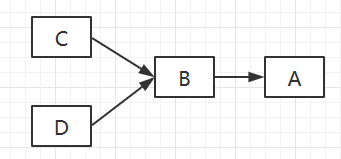

<!-- GFM-TOC -->
* [一、三大特性](#一三大特性)
    * [封装](#封装)
    * [继承](#继承)
    * [多态](#多态)
* [二、类图](#二类图)
    * [泛化关系 (Generalization)](#泛化关系-generalization)
    * [实现关系 (Realization)](#实现关系-realization)
    * [聚合关系 (Aggregation)](#聚合关系-aggregation)
    * [组合关系 (Composition)](#组合关系-composition)
    * [关联关系 (Association)](#关联关系-association)
    * [依赖关系 (Dependency)](#依赖关系-dependency)
* [三、设计原则](#三设计原则)
    * [S.O.L.I.D](#solid)
    * [其他常见原则](#其他常见原则)
* [参考资料](#参考资料)
<!-- GFM-TOC -->


# 一、三大特性

## 1、封装

利用抽象数据类型将数据和基于数据的操作封装在一起，使其构成一个不可分割的独立实体。数据被保护在抽象数据类型的内部，尽可能地隐藏内部的细节，只保留一些对外接口使之与外部发生联系。用户无需知道对象内部的细节，但可以通过对象对外提供的接口来访问该对象。

优点：
* 良好的封装能够减少耦合。
* 类内部的结构可以自由修改。
* 可以对成员进行更精确的控制。
* 隐藏信息，实现细节。

#### 示例

有点一：封装确实可以使我们容易地修改类的内部实现，而无需修改使用了该类的客户代码。
```java
public class Woman {
    private String name;
    private int age;

    public String getName() {
        return name;
    }

    public void setName(String name) {
        this.name = name;
    }

    public void setAge(int age) {
        this.age = age;
    }
}
```

从上面两个实例可以看出Woman的age也是没有getter()方法的。因为没有女人愿意别人知道她的年龄。

所以封装把一个对象的属性私有化，同时提供一些可以被外界访问的属性的方法，如果不想被外界方法，我们大可不必提供方法给外界访问。但是如果一个类没有提供给外界访问的方法，那么这个类也没有什么意义了。

通过这个我们还不能真正体会封装的好处。现在我们从程序的角度来分析封装带来的好处。如果我们不使用封装，那么该对象就没有setter()和getter()：
```java
public class Woman {
    public String name ;
    public int age ;
}

//使用
Woman woman = new Woman();
woman.name = "ad";
woman.age = 30;
```

如果需要修改Woman，例如将age修改为String类型的呢？你只有一处使用了这个类还好，如果你有几十个甚至上百个这样地方，你是不是要改到崩溃。如果使用了封装，我们完全可以不需要做任何修改，只需要稍微改变下Woman类的setAge()方法即可。
```java
public class Woman {
    
    /*
     * 对属性的封装
     * 一个人的姓名、年龄都是这个人的私有属性
     */
    private String name ;
    private String age ;    /* 改成 String类型的*/

    public String getAge() {
        return age;
    }
    
    public void setAge(int age) {
        //转换即可
        this.age = String.valueOf(age);
    }
    
    /** 省略其他属性的setter、getter **/
    
}
```

优点二：可以对成员变量进行更精确的控制

因为粗心赋了不合理的值
```java
Woman woman = new Woman();
woman.age = 300;
```
使用封装可以对age的访问入口setter方法做一些控制
```java
public class Woman {
    
    /*
     * 对属性的封装
     * 一个人的姓名、年龄都是这个人的私有属性
     */
    private String name ;
    private int age ;    /* 改成 String类型的*/

    public int getAge() {
        return age;
    }

    public void setAge(int age) {
        if(age > 120){
            System.out.println("ERROR：error age input....");    //提示錯誤信息
        }else{
            this.age = age;
        }
        
    }
    
    /** 省略其他属性的setter、getter **/
}
```

使用封装对sex的访问出口getter方法做一些控制
```java
public String getSexName() {
    if("0".equals(sex)){
        sexName = "女";
    }else if("1".equals(sex)){
        sexName = "男";
    }else{
        sexName = "人妖";
    }
    return sexName;
}
```


## 2、继承

继承是使用已存在的类的定义作为基础建立新类的技术，新类的定义可以增加新的数据或新的功能，也可以用父类的功能，但不能选择性地继承父类。通过使用继承我们能够非常方便地复用以前的代码，能够大大的提高开发的效率。

继承所描述的是“is-a”的关系，如果有两个对象A和B，若可以描述为“A是B”，则可以表示A继承于B，其中B是被继承者称之为父类或者超类，A是继承者称之为子类或者派生类。

实际上继承者是被继承者的特殊化，它除了拥有被继承者的特性外，还拥有自己独有得特性。在继承关系中，继承者完全可以替换被继承者，反之则不可以，例如我们可以说猫是动物，但不能说动物是猫就是这个道理，对于这个我们将其称之为“向上转型”。

同时在使用继承时需要记住三句话：

* **子类拥有父类非private的属性和方法。**

* **子类可以拥有自己属性和方法，即子类可以对父类进行扩展。**

* **子类可以用自己的方式实现父类的方法。（即可以重写父类方法）。**

继承一定少不了这三个东西：构造器、protected关键字、向上转型。

#### 构造器

子类可以继承父类的属性和方法，除了那些private的外还有一样是子类继承不了的---构造器。对于构造器而言，它只能够被调用，而不能被继承。 调用父类的构造方法我们使用super()即可。

对于子类而言,其构造器的正确初始化是非常重要的,而且当且仅当只有一个方法可以保证这点：在构造器中调用父类构造器来完成初始化，而父类构造器具有执行父类初始化所需要的所有知识和能力。

```java
public class Person {
    protected String name;
    protected int age;
    protected String sex;
    
    Person(){
        System.out.println("Person Constrctor...");
    }
}

public class Woman extends Person{

    Woman(){
        System.out.println("Woman Constructor...");
    }
    
    public static void main(String[] args) {
        Woman woman  = new Woman();
    }
}

Output:
Person Constrctor...
Woman Constructor...
```

通过这个示例可以看出，构建过程是从父类“向外”扩散的，也就是从父类开始向子类一级一级地完成构建。而且我们并没有显示的引用父类的构造器，这就是java的聪明之处：编译器会默认给子类调用父类的构造器。

但是，这个默认调用父类的构造器的前提是父类有默认构造器。如果父类没有默认构造器，我们就要必须显示的使用super()来调用父类构造器，否则编译器会报错：无法找到符合父类形式的构造器。

```java
public class Person {
    protected String name;
    protected int age;
    protected String sex;
    
    Person(String name){
        System.out.println("Person Constrctor-----" + name);
    }
}

public class Woman extends Person{

    Woman(){
        super("ad");
        System.out.println("Woman Constructor...");
    }
    
    public static void main(String[] args) {
        Woman woman  = new Woman();
    }
}

Output:
Person Constrctor-----chenssy
Woman Constructor...
```

所以综上所述：**对于继承而已，子类会默认调用父类的构造器，但是如果没有默认的父类构造器，子类必须要显示的指定父类的构造器，而且必须是在子类构造器中做的第一件事(第一行代码)。**

#### protected关键字

对于protected而言，它指明就类用户而言，他是private，但是对于任何继承与此类的子类而言或者其他任何位于同一个包的类而言，他却是可以访问的。

```java
public class Person {
    private String name;
    private int age;
    private String sex;

    protected String getName() {
        return name;
    }

    protected void setName(String name) {
        this.name = name;
    }

    public String toString(){
        return "this name is " + name;
    }
    
    /** 省略其他setter、getter方法 **/
}

public class Woman extends Person{

    public  String toString(){
        setName("ad");    //调用父类的setName();
        return  super.toString();    //调用父类的toString()方法
    }

    public static void main(String[] args) {
        Woman woman = new Woman();
        
        System.out.println(woman.toString());
    }
}

Output：
this name is ad
```

尽管可以使用protected访问修饰符来限制父类属性和方法的访问权限，但是最好的方式还是**将属性保持为private(我们应当一致保留更改底层实现)，通过protected方法来控制类的继承者的访问权限。**

#### 向上转型

```java
public class Person {
    public void display(){
        System.out.println("Play Person...");
    }
    
    static void display(Person person){
        person.display();
    }
}

public class Woman extends Person{
    public static void main(String[] args) {
        Woman woman = new Woman();
        Person.display(woman);      //向上转型
    }
}
```

在这我们通过Person.display(woman)。这句话可以看出woman是person类型。

将子类转换成父类，在继承关系上面是向上移动的，所以一般称之为向上转型。由于向上转型是从一个叫专用类型向较通用类型转换，所以它总是安全的，唯一发生变化的可能就是属性和方法的丢失。这就是为什么编译器在“未曾明确表示转型”活“未曾指定特殊标记”的情况下，仍然允许向上转型的原因。

#### 继承存在的问题（慎用继承）

* 父类变，子类就必须变。

* 继承破坏了封装，对于父类而言，它的实现细节对与子类来说都是透明的。

* 继承是一种强耦合关系。      

要不要使用继承呢？问一问自己是否需要从子类向父类进行向上转型。如果必须向上转型，则继承是必要的，但是如果不需要，则应当好好考虑自己是否需要继承。


## 3、多态

多态指程序中定义的引用变量所指向的具体类型和通过该引用变量发出的方法调用在编程时并不确定，而是在程序运行期间才确定。因为在程序运行时才确定具体的类，这样，不用修改源程序代码，就可以让引用变量绑定到各种不同的类实现上，从而导致该引用调用的具体方法随之改变，即不修改程序代码就可以改变程序运行时所绑定的具体代码，让程序可以选择多个运行状态，这就是多态性。

```java
public class Person {
    public void fun1(){
        System.out.println("Person 的Fun1.....");
        fun2();
    }
    
    public void fun2(){
        System.out.println("Person 的Fun2...");
    }
}

public class Woman extends Person{
    /**
     * @desc 子类重载父类方法
     *        父类中不存在该方法，向上转型后，父类是不能引用该方法的
     * @param a
     * @return void
     */
    public void fun1(String a){
        System.out.println("Woman 的 Fun1...");
        fun2();
    }
    
    /**
     * 子类重写父类方法
     * 指向子类的父类引用调用fun2时，必定是调用该方法
     */
    public void fun2(){
        System.out.println("Woman 的Fun2...");
    }
}

public class Test {
    public static void main(String[] args) {
        Person a = new Woman();
        a.fun1();
    }
}
-------------------------------------------------
Output:
Person 的Fun1.....
Woman 的Fun2...
```

从程序的运行结果中我们发现，a.fun1()首先是运行父类Person中的fun1().然后再运行子类Woman中的fun2()。

分析：在这个程序中子类Woman重载了父类Person的方法fun1()，重写fun2()，而且重载后的fun1(String a)与 fun1()不是同一个方法，由于父类中没有该方法，向上转型后会丢失该方法，所以执行Woman的Person类型引用是不能引用fun1(String a)方法。而子类Woman重写了fun2() ，那么指向Woman的Person引用会调用Woman中fun2()方法。

#### 总结如下：

指向子类的父类引用由于向上转型了，它只能访问父类中拥有的方法和属性，而对于子类中存在而父类中不存在的方法，该引用是不能使用的，尽管是重载该方法。若子类重写了父类中的某些方法，在调用该些方法的时候，必定是使用子类中定义的这些方法（动态连接、动态调用）。

对于面向对象而言，多态分为**编译时多态**和**运行时多态**。其中编辑时多态是静态的，主要是指方法的重载，它是根据参数列表的不同来区分不同的函数，通过编辑之后会变成两个不同的函数，在运行时谈不上多态。而运行时多态是动态的，它是通过动态绑定来实现的，也就是我们所说的多态性。


#### java实现多态的三个必要条件：继承、重写、向上转型

* **继承**：在多态中必须存在有继承关系的子类和父类。
* **重写**：子类对父类中某些方法进行重新定义，在调用这些方法时就会调用子类的方法。
* **向上转型**：在多态中需要将子类的引用赋给父类对象，只有这样该引用才能够具备技能调用父类的方法和子类的方法。
         
Java的多态实现机制遵循一个原则：当超类对象引用变量引用子类对象时，被引用对象的类型而不是引用变量的类型决定了调用谁的成员方法，但是这个被调用的方法必须是在超类中定义过的，也就是说被子类覆盖的方法。    
         
基于继承实现的多态总结如下：**对于引用子类的父类类型，在处理该引用时，它适用于继承该父类的所有子类，子类对象的不同，对方法的实现也就不同，执行相同动作产生的行为也就不同。**    
         
#### 经典实例
     
```java
public class A {
    public String show(D obj) {
        return ("A and D");
    }

    public String show(A obj) {
        return ("A and A");
    } 

}

public class B extends A{
    public String show(B obj){
        return ("B and B");
    }
    
    public String show(A obj){
        return ("B and A");
    } 
}

public class C extends B{

}

public class D extends B{

}

public class Test {
    public static void main(String[] args) {
        A a1 = new A();
        A a2 = new B();
        B b = new B();
        C c = new C();
        D d = new D();
        
        System.out.println("1--" + a1.show(b));
        System.out.println("2--" + a1.show(c));
        System.out.println("3--" + a1.show(d));
        System.out.println("4--" + a2.show(b));
        System.out.println("5--" + a2.show(c));
        System.out.println("6--" + a2.show(d));
        System.out.println("7--" + b.show(b));
        System.out.println("8--" + b.show(c));
        System.out.println("9--" + b.show(d));      
    }
}
```
运行结果：
```java
1--A and A
2--A and A
3--A and D
4--B and A
5--B and A
6--A and D
7--B and B
8--B and B
9--A and D
```  
     
分析过程：当超类对象引用变量引用子类对象时，被引用对象的类型而不是引用变量的类型决定了调用谁的成员方法，但是这个被调用的方法必须是在超类中定义过的，也就是说被子类覆盖的方法。其实在继承链中对象方法的调用存在一个优先级：**this.show(O)、super.show(O)、this.show((super)O)、super.show((super)O)**。

分析：

从上面的程序中我们可以看出A、B、C、D存在如下关系。

<div align="center">  </div> <br>

分析5，a2.show(c)，a2是A类型的引用变量，所以this就代表了A，a2.show(c),它在A类中找发现没有找到，于是到A的超类中找(super)，由于A没有超类（Object除外），所以跳到第三级，也就是this.show((super)O)，C的超类有B、A，所以(super)O为B、A，this同样是A，这里在A中找到了show(A obj)，同时由于a2是B类的一个引用且B类重写了show(A obj)，因此最终会调用子类B类的show(A obj)方法，结果也就是B and A。 
     
多态机制遵循的原则概括为：当超类对象引用变量引用子类对象时，被引用对象的类型而不是引用变量的类型决定了调用谁的成员方法，但是这个被调用的方法必须是在超类中定义过的，也就是说被子类覆盖的方法，但是它仍然要根据继承链中方法调用的优先级来确认方法，该优先级为：this.show(O)、super.show(O)、this.show((super)O)、super.show((super)O)。 


# 二、类图

以下类图使用 [PlantUML](https://www.planttext.com/) 绘制，更多语法及使用请参考：http://plantuml.com/ 。

## 泛化关系 (Generalization)

用来描述继承关系，在 Java 中使用 extends 关键字。

<div align="center">  </div><br>

```text
@startuml

title Generalization

class Vihical
class Car
class Trunck

Vihical <|-- Car
Vihical <|-- Trunck

@enduml
```

## 实现关系 (Realization)

用来实现一个接口，在 Java 中使用 implements 关键字。

<div align="center">  </div><br>

```text
@startuml

title Realization

interface MoveBehavior
class Fly
class Run

MoveBehavior <|.. Fly
MoveBehavior <|.. Run

@enduml
```

## 聚合关系 (Aggregation)

表示整体由部分组成，但是整体和部分不是强依赖的，整体不存在了部分还是会存在。

<div align="center">  </div><br>

```text
@startuml

title Aggregation

class Computer
class Keyboard
class Mouse
class Screen

Computer o-- Keyboard
Computer o-- Mouse
Computer o-- Screen

@enduml
```

## 组合关系 (Composition)

和聚合不同，组合中整体和部分是强依赖的，整体不存在了部分也不存在了。比如公司和部门，公司没了部门就不存在了。但是公司和员工就属于聚合关系了，因为公司没了员工还在。

<div align="center">  </div><br>

```text
@startuml

title Composition

class Company
class DepartmentA
class DepartmentB

Company *-- DepartmentA
Company *-- DepartmentB

@enduml
```

## 关联关系 (Association)

表示不同类对象之间有关联，这是一种静态关系，与运行过程的状态无关，在最开始就可以确定。因此也可以用 1 对 1、多对 1、多对多这种关联关系来表示。比如学生和学校就是一种关联关系，一个学校可以有很多学生，但是一个学生只属于一个学校，因此这是一种多对一的关系，在运行开始之前就可以确定。

<div align="center">  </div><br>

```text
@startuml

title Association

class School
class Student

School "1" - "n" Student

@enduml
```

## 依赖关系 (Dependency)

和关联关系不同的是，依赖关系是在运行过程中起作用的。A 类和 B 类是依赖关系主要有三种形式：

- A 类是 B 类方法的局部变量；
- A 类是 B 类方法当中的一个参数；
- A 类向 B 类发送消息，从而影响 B 类发生变化。

<div align="center">  </div><br>

```text
@startuml

title Dependency

class Vihicle {
    move(MoveBehavior)
}

interface MoveBehavior {
    move()
}

note "MoveBehavior.move()" as N

Vihicle ..> MoveBehavior

Vihicle .. N

@enduml
```

# 三、设计原则

## S.O.L.I.D

| 简写 | 全拼 | 中文翻译 |
| :--: | :--: | :--: |
| SRP | The Single Responsibility Principle    | 单一责任原则 |
| OCP | The Open Closed Principle              | 开放封闭原则 |
| LSP | The Liskov Substitution Principle      | 里氏替换原则 |
| ISP | The Interface Segregation Principle    | 接口分离原则 |
| DIP | The Dependency Inversion Principle     | 依赖倒置原则 |

### 1. 单一责任原则

> 修改一个类的原因应该只有一个。

换句话说就是让一个类只负责一件事，当这个类需要做过多事情的时候，就需要分解这个类。

如果一个类承担的职责过多，就等于把这些职责耦合在了一起，一个职责的变化可能会削弱这个类完成其它职责的能力。

### 2. 开放封闭原则

> 类应该对扩展开放，对修改关闭。

扩展就是添加新功能的意思，因此该原则要求在添加新功能时不需要修改代码。

符合开闭原则最典型的设计模式是装饰者模式，它可以动态地将责任附加到对象上，而不用去修改类的代码。

### 3. 里氏替换原则

> 子类对象必须能够替换掉所有父类对象。

继承是一种 IS-A 关系，子类需要能够当成父类来使用，并且需要比父类更特殊。

如果不满足这个原则，那么各个子类的行为上就会有很大差异，增加继承体系的复杂度。

### 4. 接口分离原则

> 不应该强迫客户依赖于它们不用的方法。

因此使用多个专门的接口比使用单一的总接口要好。

### 5. 依赖倒置原则

> 高层模块不应该依赖于低层模块，二者都应该依赖于抽象；</br>抽象不应该依赖于细节，细节应该依赖于抽象。

高层模块包含一个应用程序中重要的策略选择和业务模块，如果高层模块依赖于低层模块，那么低层模块的改动就会直接影响到高层模块，从而迫使高层模块也需要改动。

依赖于抽象意味着：

- 任何变量都不应该持有一个指向具体类的指针或者引用；
- 任何类都不应该从具体类派生；
- 任何方法都不应该覆写它的任何基类中的已经实现的方法。

## 其他常见原则

除了上述的经典原则，在实际开发中还有下面这些常见的设计原则。

| 简写    | 全拼    | 中文翻译 |
| :--: | :--: | :--: |
|LOD|    The Law of Demeter                   | 迪米特法则   |
|CRP|    The Composite Reuse Principle        | 合成复用原则 |
|CCP|    The Common Closure Principle         | 共同封闭原则 |
|SAP|    The Stable Abstractions Principle    | 稳定抽象原则 |
|SDP|    The Stable Dependencies Principle    | 稳定依赖原则 |

### 1. 迪米特法则

迪米特法则又叫作最少知识原则（Least Knowledge Principle，简写 LKP），就是说一个对象应当对其他对象有尽可能少的了解，不和陌生人说话。

### 2. 合成复用原则

尽量使用对象组合，而不是通过继承来达到复用的目的。

### 3. 共同封闭原则

一起修改的类，应该组合在一起（同一个包里）。如果必须修改应用程序里的代码，我们希望所有的修改都发生在一个包里（修改关闭），而不是遍布在很多包里。

### 4. 稳定抽象原则

最稳定的包应该是最抽象的包，不稳定的包应该是具体的包，即包的抽象程度跟它的稳定性成正比。

### 5. 稳定依赖原则

包之间的依赖关系都应该是稳定方向依赖的，包要依赖的包要比自己更具有稳定性。

# 参考资料

- Java 编程思想
- 敏捷软件开发：原则、模式与实践
- [面向对象设计的 SOLID 原则](http://www.cnblogs.com/shanyou/archive/2009/09/21/1570716.html)
- [看懂 UML 类图和时序图](http://design-patterns.readthedocs.io/zh_CN/latest/read_uml.html#generalization)
- [UML 系列——时序图（顺序图）sequence diagram](http://www.cnblogs.com/wolf-sun/p/UML-Sequence-diagram.html)
- [面向对象编程三大特性 ------ 封装、继承、多态](http://blog.csdn.net/jianyuerensheng/article/details/51602015)
